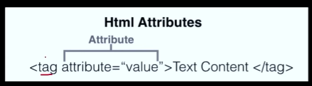
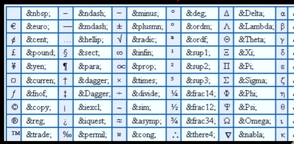

Must-Use HTML Tags

Chapter 1. HTML Attributes

1.1 What are HTML Attributes

1. Provides additional information about elements
2. Placed within opening tags
3. Common examples: href, src, alt
4. Use name = value format
5. Can be single or multiple per element

1.2 id property

* Unique Identifier: EAch id should be unique within a page
* Anchoring: Allows for direct links to sections using the #id syntax in URLs.
* CSS & JavaScript: Used for selecting elements for styling or scripting.

Chapter 2. HTML Tags

2.1 Heading Tag

1. Defines heading in a document
2. Ranges from `<h1>` to `<h6>`
3. `<h1>` is most important, `<h6>` is least
4. Important for SEO
5. Helps in structuring content

2.2 Paragraph tag

1. Used for defining paragrphs
2. Enclosed within `
` and `
` tags
3. Adds automatic spacing before and after
4. Text wraps to next line inside tag
5. Common in text-heavy content

2.3 ` ` tag & `
` tag

1. ` ` adds a line break within text
2. ` ` is empty, no closing tag needed
3. ` ` and ` ` are both valid

1. Create a horizontal rule or line
2. `
` also empty, acts as a divider

2.4 Image Tag

1. Used to Embed images
2. Utilizes the src attribute for image URL
3. alt attribute for relative text
4. Can be resized using width and height
5. Self-closing, dosen't require an end tag

2.5 Video Tag

1. Embeds video files on a page
2. Uses src attribute for video URL
3. Supports multiple formats like MP4, WebM
4. Allows for built-in controls via attribute like autoplay, controls, loop.

heavy files which are not images or code files are all stored in assets folder for use.

2.6 Anchor Tag

1. Used for creating hyperlinks
2. Requires href attribute for URL
3. Can link to external sites or internal pages
4. Supports target attribute to control link behavior

2.7 Bold / Italic / Underline / Strikethrough

1. `<b>` makes text bold
2. `<i>` makes text italic
3. `<u>` underlines the text
4. `<s>` or `<strike>` applies strikethrough
5. Primarily used for text styling and emphasis

2.8 Pre Tag

1. Preserve text formatting
2. Maintains whitespace and line breaks
3. Useful for displaying code
4. Enclosed within `<pre>` and `</pre>` tags

2.9 Big/ Small Tag

1. `<big>` increases text size
2. `<small>` decreases text size
3. Less common due to CSS alternatives

2.10 Superscript/ Subscript Tag

1. `` makes text superscript
2. `` makes text superscript
3. Used for mathematical equations, footnotes
4. Does not change font size, just position

Chapter 3. Character Entity Rreference

1. Used to Display reserverd or special characters
2. Syntax often starts with & and ends with ; (eg., `&amp;` for &)

