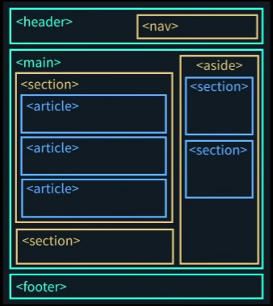

HTML and Project Structure

Chapter 1. Semantic Tags

1.1 Semantic / Non- Sematic Tags

Semantic Tags

* Meaningful: Describe content.
* SEO: Good for search engines.
* Accessibility: Useful for screen readers.
* Example: `<header>, <footer>, <article>, <section>, <nav>`

Non-Semantic Tags

* Generic: No specific meaning
* For styling: Used for layout
* No SEO: Not SEo-friendly
* Example: `
, <i>, , <b>`

Chapter 2. Body Tags

2.1 Header Tag

1. Purpose: Used to contain introductory content or navigation links
2. Semantic: It's a semantic tag, providing meaning to the enclosed content.
3. Location: Commonly found at the top of web pages, but also appears within `<article>` or `<section>` tags.
4. Multiple Instances: Can be used more than once on a page within different sections.

Chapter 3. Folder Structure

Chapter 4. More Tags